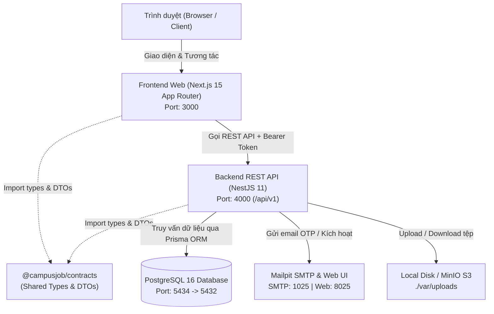

# CampusJob — Nền Tảng Việc Làm Thêm & Thực Tập Cho Sinh Viên (Monorepo)

Hệ thống **CampusJob** được xây dựng theo kiến trúc **Monorepo hiện đại** (quản lý bởi `pnpm workspace`), phân tách độc lập giữa **Frontend (Next.js 15)** và **Backend (NestJS 11 REST API)**, kết nối cơ sở dữ liệu **PostgreSQL 16** qua **Prisma ORM**. Hệ thống hỗ trợ phát triển local 100% không phụ thuộc các dịch vụ bên thứ ba nhờ môi trường Docker Compose (PostgreSQL, Mailpit SMTP).

---

## 1. Kiến Trúc Hệ Thống (Architecture Overview)

### 1.1. Sơ đồ Luồng Hoạt Động (Data Flow)



### 1.2. Cơ Chế Xác Thực & Phân Quyền (Auth & RBAC)

* **Access Token (Ngắn hạn - 15 phút):** Cấp dưới dạng JWT, lưu trữ trong **bộ nhớ RAM** của trình duyệt (`apps/web/src/lib/api.ts`), tự động đính kèm qua header `Authorization: Bearer <token>`.
* **Refresh Token (Dài hạn - 30 ngày):** Lưu trữ trong cookie an toàn `HttpOnly; SameSite=Lax; Path=/api/v1/auth`. Trong database chỉ lưu **SHA-256 hash** (`auth_sessions`).
* **Cơ chế Token Rotation & Reuse Detection:** Mỗi lần refresh token sẽ cấp một cặp token mới. Nếu phát hiện refresh token cũ bị dùng lại (dấu hiệu tấn công), toàn bộ phiên thuộc chuỗi (`tokenFamily`) sẽ bị thu hồi ngay lập tức.
* **Mã hóa mật khẩu:** Sử dụng thuật toán chuẩn công nghiệp **Argon2id**.
* **Phân quyền (RBAC):** Gồm 4 vai trò chính:
  * `student`: Sinh viên tìm việc, tạo CV, ứng tuyển, đặt lịch phỏng vấn, gửi đánh giá.
  * `employer`: Nhà tuyển dụng quản lý hồ sơ công ty, chi nhánh, đăng tin, duyệt ứng viên, phỏng vấn.
  * `moderator`: Kiểm duyệt viên duyệt tin tuyển dụng, giải quyết báo cáo, xử lý đánh giá.
  * `admin`: Quản trị viên tối cao, xem báo cáo thống kê, khóa tài khoản, cấp quyền, cấu hình hệ thống.

---

## 2. Hướng Dẫn Khởi Chạy Dự Án Từ Con Số 0 (Quickstart For Developers)

### 2.1. Yêu cầu môi trường tiền đề (Prerequisites)

Trước khi bắt đầu, hãy đảm bảo máy tính đã cài đặt:
* **Node.js**: Phiên bản `>= 20.x` (khuyến nghị Node `22.x LTS`).
* **pnpm**: Phiên bản `>= 10.x` hoặc `11.x` (`npm install -g pnpm`).
* **Docker & Docker Desktop**: Để chạy container PostgreSQL và Mailpit.
* **Git**: Quản lý phiên bản mã nguồn.

---

### 2.2. Các bước cài đặt và khởi chạy chi tiết

#### Bước 1: Clone mã nguồn và cài đặt dependencies
Mở Terminal / PowerShell tại thư mục làm việc:
```powershell
git clone <repository-url>
cd CampusJob_Nhom11
pnpm install
```

#### Bước 2: Thiết lập biến môi trường (.env)
Sao chép tệp cấu hình mẫu sang `.env` ở thư mục gốc:
```powershell
# Trên Windows PowerShell:
Copy-Item .env.example .env

# Hoặc trên Linux/macOS/Git Bash:
cp .env.example .env
```
*(Các thông số trong `.env.example` đã được cấu hình sẵn phù hợp 100% cho việc chạy local development).*

#### Bước 3: Khởi động các dịch vụ phụ trợ qua Docker
Khởi chạy container PostgreSQL và Mailpit:
```powershell
docker compose -f infra/docker-compose.yml up -d
```
Kiểm tra trạng thái container:
```powershell
docker compose -f infra/docker-compose.yml ps
```
*(Kết quả hiển thị `campusjob-postgres` ở port `5434:5432` và `campusjob-mailpit` ở port `1025/8025` ở trạng thái Healthy / Up).*

#### Bước 4: Tạo cấu trúc cơ sở dữ liệu & Nạp dữ liệu mẫu (Prisma Migrate & Seed)
Chạy migration để khởi tạo 26 bảng dữ liệu trên PostgreSQL và nạp sẵn tài khoản Quản trị viên mặc định:
```powershell
pnpm db:generate
pnpm db:migrate
pnpm db:seed
```
Lệnh `pnpm db:seed` sẽ tự động khởi tạo **Tài khoản Quản trị viên (Admin) mặc định**:
* **Email:** `admin@campusjob.vn`
* **Mật khẩu:** `Admin@12345678`
* **Vai trò:** `admin`

#### Bước 5: (Tùy chọn) Khởi tạo thêm Quản trị viên tùy chỉnh (CLI)
Nếu muốn tạo thêm tài khoản Quản trị viên riêng biệt bằng CLI:
```powershell
pnpm admin:create --email your-admin@campusjob.vn --name "System Admin"
```
*(CLI sẽ prompt nhập mật khẩu trực tiếp từ terminal hoặc bạn có thể truyền `--password <mat_khau>`)*.

#### Bước 6: Khởi chạy môi trường phát triển (Development)
Chạy lệnh khởi động đồng thời cả Frontend và Backend:
```powershell
pnpm dev
```
Sau khi lệnh chạy, hệ thống sẽ mở đồng thời:
* **Backend API**: `http://localhost:4000/api/v1`
* **Frontend Web**: `http://localhost:3000`

---

### 2.3. Bảng Địa Chỉ Truy Cập Dịch Vụ

| Dịch vụ | Địa chỉ URL | Mục đích sử dụng |
| :--- | :--- | :--- |
| **Frontend Web** | `http://localhost:3000` | Giao diện người dùng: Tìm việc, Đăng ký, Đăng nhập, Bảng làm việc |
| **Backend REST API** | `http://localhost:4000/api/v1` | Điểm tiếp nhận API endpoint |
| **Swagger API Docs** | `http://localhost:4000/docs` | Tài liệu OpenAPI tương tác và kiểm thử trực tiếp các endpoints |
| **Mailpit Web UI** | `http://localhost:8025` | Hòm thư cục bộ xem email kích hoạt tài khoản, mã OTP, link đổi mật khẩu |
| **PostgreSQL Host Port**| `localhost:5434` | Cổng kết nối CSDL từ DBeaver / TablePlus / pgAdmin |
| **Local Uploads** | `./var/uploads` | Thư mục lưu trữ tệp đính kèm cục bộ (tự động tạo) |

---

### 2.4. Đăng Ký & Trải Nghiệm Các Phân Hệ

1. **Tài khoản Quản trị (Admin):**
   * Đăng nhập bằng email/mật khẩu vừa tạo ở Bước 5 tại `http://localhost:3000/login`.
   * Truy cập giao diện quản trị: `http://localhost:3000/workspace`.
2. **Tài khoản Sinh viên (Student) / Doanh nghiệp (Employer):**
   * Truy cập `http://localhost:3000/register`.
   * Chọn vai trò *Sinh viên* hoặc *Doanh nghiệp*, điền email và mật khẩu.
   * Mở Mailpit Web UI tại `http://localhost:8025` để lấy link/mã xác nhận email.
   * Hoàn tất xác minh và đăng nhập vào Workspace riêng của vai trò đó.

---

## 3. Cấu Trúc Thư Mục & Vai Trò Các Tệp Tin

```text
CampusJob_Nhom11/
├── apps/
│   ├── api/                          # [BACKEND] Ứng dụng NestJS REST API Server
│   │   ├── prisma/
│   │   │   ├── schema.prisma         # Định nghĩa 26 mô hình CSDL PostgreSQL & Enums
│   │   │   └── migrations/           # Lịch sử các phiên bản migration CSDL
│   │   ├── src/                      # Mã nguồn logic backend (chia theo Modules)
│   │   │   ├── admin/                # Bảng điều khiển quản trị, phân quyền, thống kê
│   │   │   ├── applications/         # Quy trình sinh viên nộp hồ sơ và ứng tuyển
│   │   │   ├── audit/                # Ghi vết lịch sử hành vi (Audit logging)
│   │   │   ├── auth/                 # Đăng ký, đăng nhập, JWT, refresh token, đổi mật khẩu
│   │   │   ├── branches/             # Quản lý chi nhánh doanh nghiệp & tọa độ GPS
│   │   │   ├── cli/                  # Script CLI tạo admin ban đầu (create-admin.ts)
│   │   │   ├── common/               # Guards (Roles, JWT), Decorators, Exception Filters
│   │   │   ├── companies/            # Hồ sơ doanh nghiệp & xác minh giấy phép
│   │   │   ├── config/               # Cấu hình biến môi trường & validation config
│   │   │   ├── cvs/                  # Quản lý hồ sơ CV của ứng viên
│   │   │   ├── files/                # Upload, tải và kiểm tra phân quyền truy cập file
│   │   │   ├── interviews/           # Lên lịch phỏng vấn, chấp nhận / dời lịch
│   │   │   ├── jobs/                 # Đăng tin tuyển dụng, tìm kiếm, lọc, gợi ý việc làm
│   │   │   ├── mail/                 # Dịch vụ gửi email thông báo qua Mailpit / SMTP
│   │   │   ├── maintenance/          # Vận hành, kiểm tra healthcheck & cron tasks
│   │   │   ├── messages/             # Nhắn tin trao đổi trực tiếp trong từng đơn ứng tuyển
│   │   │   ├── moderation/           # Hàng đợi duyệt tin, thẩm tra báo cáo vi phạm
│   │   │   ├── notifications/        # Quản lý thông báo trong ứng dụng
│   │   │   ├── payments/             # Đơn hàng gói đăng tin & xác thực Stripe Webhook
│   │   │   ├── prisma/               # PrismaService kết nối và quản lý vòng đời CSDL
│   │   │   ├── reports/              # Người dùng báo cáo vi phạm, gian lận
│   │   │   ├── reviews/              # Đánh giá và phản hồi chất lượng doanh nghiệp
│   │   │   ├── storage/              # Storage Adapter (Local Disk / AWS S3 / MinIO)
│   │   │   ├── users/                # Quản lý tài khoản và hồ sơ cá nhân
│   │   │   ├── app.module.ts         # Module gốc của ứng dụng NestJS
│   │   │   └── main.ts               # Điểm khởi chạy (Bootstrap CORS, Cookie, Swagger)
│   │   ├── test/                     # Kiểm thử tích hợp E2E REST API endpoints
│   │   └── package.json              # Dependencies và scripts riêng của Backend
│   │
│   └── web/                          # [FRONTEND] Ứng dụng Next.js 15 Web Client
│       ├── public/                   # Tài nguyên tĩnh phục vụ client (favicon, icons)
│       ├── src/
│       │   ├── app/                  # Next.js App Router
│       │   │   ├── login/            # Trang đăng nhập
│       │   │   ├── register/         # Trang đăng ký (phân loại Student / Employer)
│       │   │   ├── forgot-password/  # Yêu cầu đặt lại mật khẩu
│       │   │   ├── reset-password/   # Nhập mật khẩu mới từ link email
│       │   │   ├── verify-email/     # Trang xác thực tài khoản qua email
│       │   │   ├── [...slug]/        # Cổng thông tin việc làm động (Dynamic Portal)
│       │   │   ├── layout.tsx        # Layout gốc, nạp font chữ và cấu hình meta
│       │   │   └── globals.css       # Định nghĩa theme & tokens Tailwind CSS v4
│       │   ├── components/           # Các thành phần giao diện người dùng
│       │   │   ├── portal.tsx        # Trang chủ tìm kiếm và chi tiết tin tuyển dụng
│       │   │   ├── workspace.tsx     # Bảng làm việc phân quyền theo từng vai trò
│       │   │   ├── common-ui.tsx     # Các component dùng chung (Badge, Card, Alert)
│       │   │   └── ui/               # Radix UI primitives (Dialog, Select, Tabs,...)
│       │   ├── lib/
│       │   │   ├── api.ts            # Client gọi REST API (In-memory token + Refresh)
│       │   │   └── utils.ts          # Tiện ích bổ trợ (cn, format ngày giờ, tiền tệ)
│       │   └── vendor/               # Styles và thư viện tiện ích cục bộ
│       └── package.json              # Dependencies và scripts riêng của Frontend
│
├── packages/
│   └── contracts/                    # [SHARED CONTRACTS] Gói thư viện chia sẻ
│       ├── src/
│       │   └── index.ts              # Định nghĩa UserRole, UserStatus, ErrorResponse, DTOs
│       └── package.json              # Cấu hình xuất bản module @campusjob/contracts
│
├── infra/
│   └── docker-compose.yml            # Cấu hình container Docker (PostgreSQL 16, Mailpit)
│
├── docs/                             # Tài liệu kỹ thuật dự án
│   ├── API_MIGRATION.md              # Bảng ánh xạ danh mục REST API endpoints đầy đủ
│   ├── DATABASE_MIGRATION.md         # Tài liệu thiết kế CSDL PostgreSQL và quan hệ bảng
│   └── INVENTORY_PRE_MIGRATION.md    # Báo cáo kiểm kê cấu trúc hệ thống
│
├── .env.example                      # Tệp cấu hình biến môi trường mẫu
├── .env                              # Tệp biến môi trường thực tế (được .gitignore bảo vệ)
├── .gitignore                        # Danh sách loại trừ file tạm, cache, bản build
├── .npmrc                            # Tối ưu hóa pnpm và cấu hình build native modules
├── package.json                      # Tệp cấu hình điều phối gốc của toàn bộ Monorepo
├── pnpm-workspace.yaml               # Định nghĩa danh sách các gói workspace
├── tsconfig.json                     # Cấu hình TypeScript cơ sở cho Monorepo
└── README.md                         # Tài liệu giới thiệu và hướng dẫn tổng thể
```

---

## 4. Danh Mục Lệnh Thao Tác (Monorepo Commands)

Dự án cung cấp hệ thống lệnh điều phối tập trung tại thư mục gốc:

| Lệnh | Ý nghĩa & Tác vụ |
| :--- | :--- |
| `pnpm dev` | Khởi chạy song song cả `@campusjob/api` (port 4000) và `@campusjob/web` (port 3000) |
| `pnpm build` | Biên dịch bản production cho cả 3 gói: Contracts -> API -> Web |
| `pnpm typecheck` | Kiểm tra tính đúng đắn của toàn bộ TypeScript trên tất cả workspace |
| `pnpm lint` | Kiểm tra quy chuẩn cú pháp mã nguồn qua ESLint cho cả Backend và Frontend |
| `pnpm test` | Chạy bộ kiểm thử đơn vị Unit Tests (Jest) cho các module Backend |
| `pnpm test:e2e` | Chạy bộ kiểm thử tích hợp End-to-End API (Supertest) |
| `pnpm db:generate` | Biên dịch lại Prisma Client dựa trên `schema.prisma` mới nhất |
| `pnpm db:migrate` | Áp dụng các thay đổi cấu trúc bảng vào cơ sở dữ liệu PostgreSQL |
| `pnpm db:seed` | Nạp tài khoản Quản trị viên (Admin) mặc định và dữ liệu mẫu |
| `pnpm admin:create` | Công cụ dòng lệnh cấp quyền tài khoản Quản trị viên (Admin) tùy chỉnh |

---

## 5. Xử Lý Sự Cố Thường Gặp (Troubleshooting)

1. **Lỗi xung đột cổng `5434` khi chạy Docker:**
   * Cổng PostgreSQL của dự án được cấu hình ở cổng host `5434` (để tránh xung đột với PostgreSQL có sẵn trên cổng `5432` của máy tính). Nếu cổng `5434` đã bị ứng dụng khác chiếm dụng, bạn có thể đổi `POSTGRES_PORT=5435` trong file `.env` và cập nhật lại `DATABASE_URL`.
2. **Lỗi `Cannot connect to database` khi chạy `pnpm db:migrate`:**
   * Đảm bảo Docker Desktop đang bật và container `campusjob-postgres` đang chạy (`docker compose -f infra/docker-compose.yml ps`).
3. **Lỗi `Prisma Client not initialized`:**
   * Chạy lại lệnh `pnpm db:generate` để tạo lại mã nguồn TypeScript cho Prisma Client.
4. **Không nhận được email kích hoạt / OTP:**
   * Kiểm tra giao diện hòm thư Mailpit cục bộ tại `http://localhost:8025`. Toàn bộ email trong môi trường local đều được chuyển hướng an toàn về đây.
