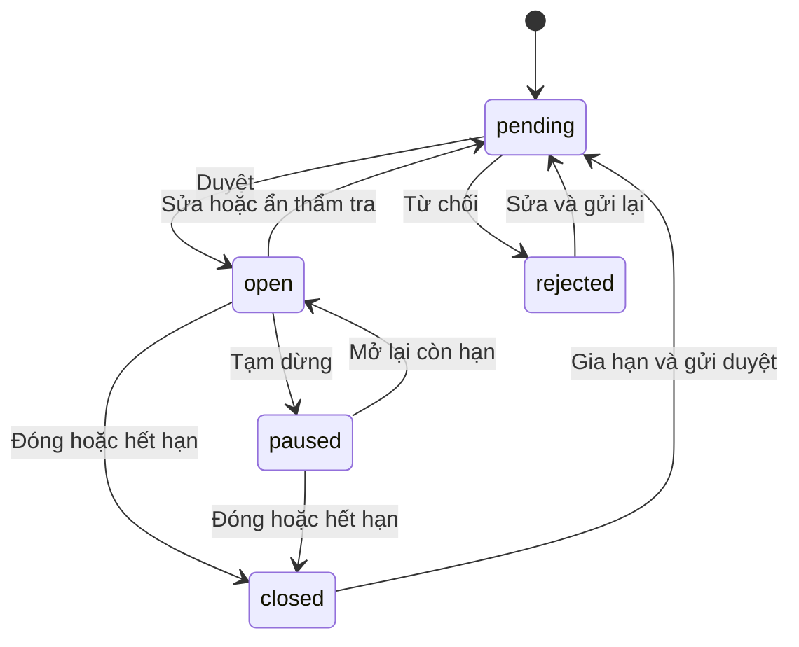
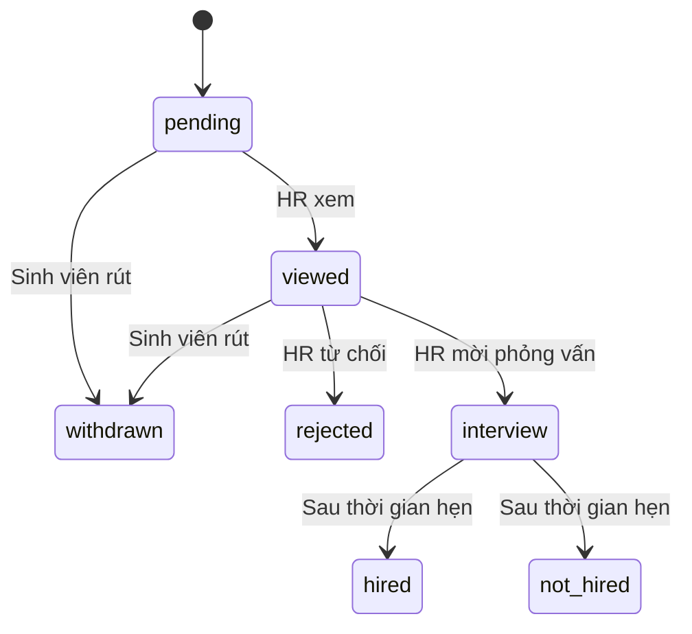

# Nguồn yêu cầu và quyết định triển khai

## Thứ tự ưu tiên

1. PDF đề cương 4 trang: “Hệ thống quản lý việc làm thêm và thực tập cho sinh viên”. Tên file nguồn chứa Nhóm 6; sản phẩm dùng Nhóm 11 theo yêu cầu mới nhất. Không thay nội dung đề tài.
2. Yêu cầu bổ sung kiểm duyệt viên và không dùng dữ liệu mẫu của người dùng.
3. SRS, bản CSDL và các phân tích trong phiên làm việc: tài liệu tham khảo, không tự coi các đề xuất còn mở là quyết định người dùng đã chốt.
4. Lamthem.com.vn: tham khảo hành trình tìm kiếm, lọc vị trí, loại việc và trình bày tin. Không sao chép nhãn hiệu, hình ảnh doanh nghiệp, tin hay tài khoản từ website đó.

## Ánh xạ với đề cương

| Nhóm yêu cầu | Vị trí | Tình trạng |
|---|---|---|
| Pháp lý doanh nghiệp, xác thực, từ chối/gửi lại | Doanh nghiệp; Quản trị / Doanh nghiệp | Đã triển khai |
| Nhiều chi nhánh và tọa độ | Chi nhánh; trang doanh nghiệp | Đã triển khai; liên kết bản đồ bên ngoài |
| Điểm uy tín ưu tiên kết quả | Truy vấn tìm việc | Công thức đề xuất; chưa có kiểm chứng mô hình |
| Thông tin tin, ngành, loại, lương, thời gian, hạn | Tin tuyển dụng | Đã triển khai |
| Duyệt tin, từ chối có lý do, tạm ẩn | Kiểm duyệt; trang chi tiết tin | Đã triển khai |
| Hết hạn và nhắc trước 3 ngày | Tác vụ vận hành và truy vấn | Có chặn hết hạn; lịch đúng giờ cần dịch vụ bên ngoài |
| Hồ sơ cá nhân, nhiều CV và mặc định | Hồ sơ cá nhân; CV của tôi | Đã triển khai |
| Tối đa 5 hồ sơ chờ xử lý, rút hồ sơ | Ứng tuyển | Đã triển khai cách hiểu bên dưới |
| Bản CV nộp, thư giới thiệu, sắp xếp phù hợp | Ứng tuyển; Ứng viên | Đã triển khai |
| Xem, từ chối, hẹn phỏng vấn | Chi tiết hồ sơ | Đã triển khai |
| Xác nhận, đổi lịch 1 lần, xử lý đề nghị | Chi tiết hồ sơ; Phỏng vấn | Đã triển khai |
| Kết quả cuối, gợi ý đóng tin đủ số lượng | Chi tiết hồ sơ; Tin tuyển dụng | Đã triển khai |
| Báo cáo sinh viên, bằng chứng, 2/3 vi phạm | Báo cáo; Kiểm duyệt; Quản trị | Đã triển khai |
| Đánh giá cuối quy trình, phản hồi 1 lần | Chi tiết hồ sơ; Đánh giá; trang doanh nghiệp | Đã triển khai |
| Cờ lừa đảo / >30% một sao với >=10 đánh giá | Báo cáo, đánh giá, Quản trị | Đã triển khai, không tự đình chỉ |
| Đình chỉ và ẩn toàn bộ tin | Quản trị / Doanh nghiệp | Đã triển khai |
| Thông báo trong ứng dụng + email tùy chọn | Thông báo; hàng đợi email | In-app đã triển khai; email cần cấu hình và nghiệm thu thật |
| 8 báo cáo, xuất kết quả | Báo cáo thống kê / CSV | Đã triển khai; định nghĩa CV chất lượng là chỉ số hỗ trợ |
| Gợi ý công việc | Gợi ý việc làm | Quy tắc dựa trên CV, chuyên ngành, ngành từng ứng tuyển |
| Chat sau lời mời phỏng vấn | Chi tiết hồ sơ | Đã triển khai; làm mới định kỳ 20 giây |
| Email trường / OTP | Hồ sơ cá nhân | Adapter thật có mã 6 chữ số, 10 phút, 5 lần thử; cần mail provider |
| Gói tin nổi bật | Dịch vụ; gói dịch vụ | Backend Checkout/webhook và quản lý gói đã viết; chưa cấu hình hoặc kiểm thử thanh toán thật |
| Xem trước ứng viên tiềm năng có trả phí | Không mở | Chưa triển khai; cần chốt sự đồng ý và phạm vi chia sẻ CV |
| Email/mật khẩu riêng, PostgreSQL | Không dùng trong bản Sites | Khác biệt nền tảng cần được người dùng chấp nhận hoặc triển khai stack khác |

## Quy tắc đang áp dụng, chưa phải biên bản người dùng đã phê duyệt

- Hạn mức 5 tính `pending`, `viewed`, `interview`. PDF gọi “Đang chờ xử lý” nhưng tiếp tục nói chỉ được thêm khi có kết quả cuối hoặc tự rút. Bản này áp dụng cách hiểu toàn bộ hồ sơ chưa kết thúc, cùng hướng với CSDL trước. Nếu nhóm muốn chỉ đếm literal `pending`, phải thay query hạn mức, nội dung UI và kiểm tra tương ứng.
- Mỗi sinh viên ứng tuyển một lần cho một tin; rút không được nộp lại. Đây là đề xuất của bản CSDL cũ, PDF không quy định rõ.
- Bốn vai trò loại trừ nhau trên một tài khoản. Doanh nghiệp có một tài khoản HR sở hữu và nhiều chi nhánh; chưa có nhóm nhiều HR/mời thành viên.
- Giữ 4 loại công việc đúng PDF, gồm “Làm việc từ xa”. Không áp dụng đề xuất tách Remote thành work mode trong SQL trước.
- Sửa nội dung tin luôn phải duyệt lại. Sửa pháp lý doanh nghiệp đưa về pending và tạm ngừng công khai các tin. Sửa chi nhánh đưa tin đang tuyển/tạm dừng về pending.
- Điểm khớp = số kỹ năng bắt buộc trùng với CV / tổng kỹ năng bắt buộc ×100. Chuẩn hóa chữ thường và cắt khoảng trắng; không dùng mô hình AI, không tự suy diễn năng lực.
- Gợi ý = điểm kỹ năng +20 nếu tên ngành chứa chuyên ngành + tối đa10 theo số lần ứng tuyển vào ngành đó. Không cam kết là mô hình dự đoán thành công.
- Điểm uy tín đề xuất =40×tỷ lệ tin hiện ở open/paused/closed +12×điểm sao trung bình −10×số báo cáo xác nhận. Chỉ xếp hạng, không tự cấp chứng nhận “đối tác tin cậy”. Nhóm cần duyệt công thức trước khi sử dụng như chính sách chính thức.
- Lượt xem tính một lần cho tài khoản / tin / ngày UTC; không tính anonymous. Tổng lượt lưu là số người hiện đang lưu.
- Hồ sơ đủ kỹ năng không đồng nghĩa “CV chất lượng”; báo cáo hiển thị tỷ lệ khớp và mời phỏng vấn riêng.
- Một lịch phỏng vấn cho mỗi ứng tuyển, một đề nghị đổi lịch dù chấp thuận hoặc bác bỏ.
- Vi phạm 6 tháng tính theo thời điểm sự việc: ngày phỏng vấn hoặc ngày bỏ việc có khai báo và minh chứng. Một sự việc / loại không thể được ghi nhận lặp để cộng nhiều vi phạm.
- 2 vi phạm cảnh cáo; từ3 quản trị viên chọn30–90 ngày. Không tự khóa chỉ dựa vào báo cáo chưa xác nhận.
- >30% một sao với >=10 đánh giá đang hiển thị tạo cờ. Gỡ cờ cần kết luận báo cáo và không còn vượt ngưỡng; cờ không tự đình chỉ.
- Mỗi gói trả phí chỉ làm nổi bật tin còn mở. Đóng/hết hạn/đình chỉ vẫn làm tin không hiển thị dù đã mua gói. Hoàn tiền/đối soát chưa triển khai.
- Bộ lọc hiện trả tối đa500 tin/doanh nghiệp và chat trả500 tin nhắn. Đây là giới hạn beta; cần phân trang đầy đủ trước dữ liệu lớn.

## Trạng thái

